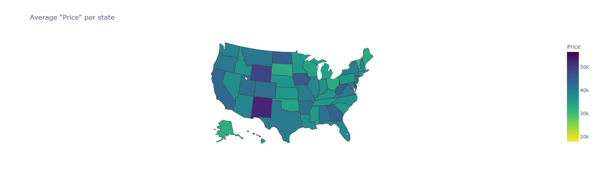
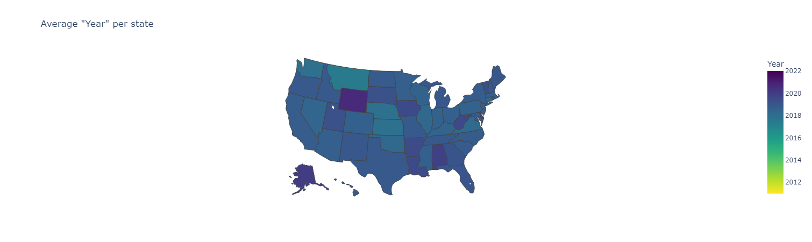
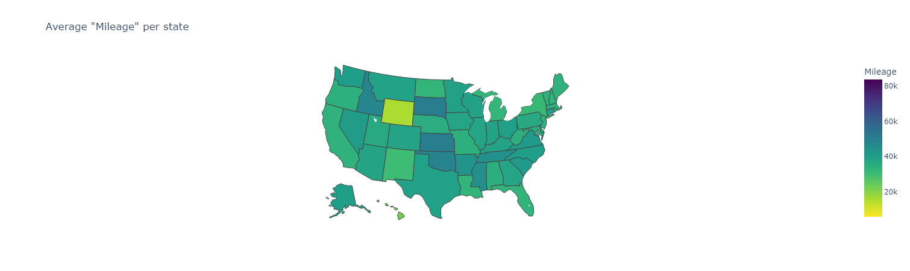

# The Problem

Because the dataset is a record of car listings, there is no information about the general trends of the listed cars.
This includes the cars' average price, year, color, and more. 
In addition to this, the dataset provides highly specific location data of the seller.
This means that the general trends could also be tracked geographically. This is what I set out to do.

Specifically, I wanted to answer the following questions:
* Which US region has the lowest average listing price?
* Which state sells the newest cars?
* Which state has the highest mileage?

[View on Kaggle](https://www.kaggle.com/code/spresto/acm-research-2022)

[The Results](#the-results) <br>
[Other Important Info](#other-info)

# The Process

First, I imported the dataset into a Pandas DataFrame
```python
car_data = pd.read_csv('./cars_raw.csv')
```

Because the data is not organized by state, I used a technique I learned on another project to find the average value of every column by state.
```python
parsed_data = car_data.groupby(['State']).mean()
```

By finding the lowest or highest value in a column and viewing its index (a state), I was able to answer the last two questions. However, this does not help with the first question. After all, I am trying to analyze the general trends. Therefore, a graph would work better.
<br><br>
I used [this](https://medium.com/geekculture/create-a-choropleth-map-of-state-unemployment-rates-with-plotly-1354050e0cfd) medium article that discussed plotting median incomes across states using ```plotly```. This proved to be the perfect library for plotting information about states. But before I could use the method discussed in the article, I needed to move the states back into a column.
```python
parsed_data.reset_index(inplace=True)
```

Finally, I created a list of the metrics I wanted to analyze (Price, Year, and Mileage) and used a for loop to create three figures representing each metric.

```python
COLUMNS_TO_SHOW = [ 'Price', 'Year', 'Mileage']

for col in COLUMNS_TO_SHOW:
    fig = px.choropleth(parsed_data,
                        locations='State',
                        locationmode='USA-states',
                        scope='usa',
                        color=col,
                        color_continuous_scale='Viridis_r',
                        title='Average "' + col + '" per state')

    fig.show()
```

However, this gave an error because 'Price' was not a column. It had been removed when finding the average because it was not actually a number, it was a string. I then added code to transform it into a valid integer using [this](https://stackoverflow.com/questions/15891038/change-column-type-in-pandas)
Stackoverflow answer.
```python
car_data['Price'] = car_data['Price'].map(lambda x: x[1:].replace(',', ''))
car_data['Price'] = pd.to_numeric(car_data['Price'], errors='coerce')
car_data.dropna(inplace=True)
```

# The Results

According to the graph, on average, northeastern states have slightly lower-priced listings compared to the west. Out of all of the states, New Mexico has the highest average listing price.
<br><br><br>


On average, Wyoming's listings have the newest cars with an average year of 2020.67. Alaska is close behind with an average of exactly 2020.
<br><br><br>


Finally, Wyoming has by far the lowest average mileage with 15.9k.

# Other Info

Required Libraries
* pandas
* plotly
* nbformat

Required Files
* [cars_raw.csv](https://www.kaggle.com/datasets/chancev/carsforsale)

Outside Help
* https://medium.com/geekculture/create-a-choropleth-map-of-state-unemployment-rates-with-plotly-1354050e0cfd
* https://stackoverflow.com/questions/15891038/change-column-type-in-pandas